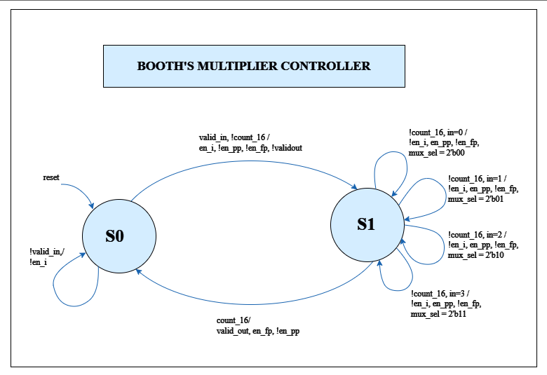

# Booth's Multiplier for 16-bit Signed and Unsigned Multiplication

## Overview
  This repository contains an implementation of Booth's Multiplier, a hardware algorithm widely used for multiplying binary numbers efficiently. The implementation supports both signed and unsigned 16-bit multiplication.


## Description

  Booth's Multiplier is an algorithm that performs binary multiplication using a combination of addition and shifting operations. It is known for its efficiency in reducing the number of partial products, making it suitable for hardware implementations.

## Languages Used
  * System Verilog
  * C++
  * Makefile 

# Key Features

  * Support for Signed and Unsigned Multiplication:  
    The multiplier is designed to handle both signed and unsigned 16-bit multiplication, providing flexibility for various use cases.

  * Efficient Bit Manipulation: 
    The implementation optimizes the multiplication process by efficiently handling bit manipulations and reducing the number of partial products.


## Environments Used

  * Linux Ubuntu 22.04.2

# System Design Overview

  Representation of architecture through clear block diagrams is shown below.

## Datapath Block Diagram

The block diagram of the Datapath depicts the flow of data within the multiplier's components, including partial product generation, shifting units, and the overall computation path.

 

## Controller Block Diagram

Additionally, the Controller block diagram demonstrates the control signals governing the operation of the multiplier. These visual representations offer an insightful overview of the multiplier's internal structure, aiding in understanding its functionality and facilitating potential integrations into larger digital systems.

 


# Getting Started

## 1. Clone the Repository
       
To use the Booth's Multiplier implementation, clone this project using HTTPS:

 ```markdown
 git clone https://github.com/Fazail333/Booths_Multiplier.git
```

## 2. Installation of Vivado and Verilator 

Install [Vivado](https://github.com/ALI11-2000/Vivado-Installation) and [Verilator](https://verilator.org/guide/latest/install.html). Follow the instructions provided in the corresponding links to build these tools.

## Build Model and Run Simulation

To build Booth's Multiplier, use the provided Makefile. Follow the steps below for simulation using Verilator or Vivado.

### Simulation with Verilator
Run the following command to simulate using Verilator:

```markdown
  make verilator
```


To view the waveform generated by Verilator, execute:

```markdown
make ver_waves
 ```
### Simulation with Vivado
For simulation on vivado run the following command:

```markdown
make vivado
```

The waves on vivado will be created that can be viewed by running

```markdown
make viv_waves
``` 

# Successful Implementation

## Implementation with Verilator

Upon successful execution of the `make verilator` command, the terminal log output for the 16-bit multiplier, implementing signed and unsigned multiplication using Booth's Algorithm, is presented below:


### Implementation with Vivado

Running the `make vivado` command generates the terminal log output as shown below:


